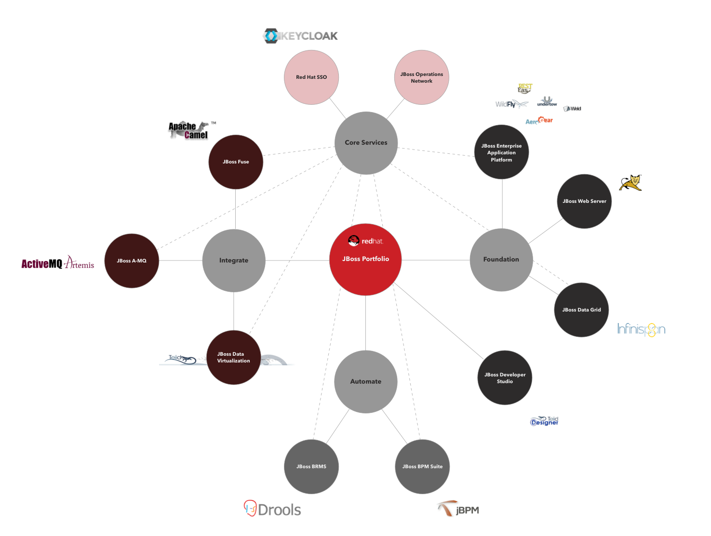

# Awesome JBoss

A list curating resources and information related to JBoss Middleware. The broad range of products, upstream projects and people involved makes it difficult to structurize this information - stay tuned and be patient, later (or later [or later {or later}]) you'll get a nicely structured information pool on JBoss resources here :)

## Official Sites

### Community
* [JBoss Developer](http://www.jboss.org) (http://www.jboss.org)
* [JBoss Developer: JBoss Community >>>Forums<<<](http://www.jboss.org/forums)

### Red Hat
* [Red Hat JBoss Middleware Landing Page](http://www.redhat.com/en/technologies/jboss-middleware)
* [Red Hat Developers: JBoss Enterprise Application Platform](http://developers.redhat.com/products/eap/overview/) 
* [Red Hat Customer Discussions (needs manual filtering first)](https://access.redhat.com/discussions?keyword=&name=&product=All&category=All&tags=All)

(NB - update needed).

## Subprojects
### Red Hat <-> Community (aka Upstream)

Red Hat's general categories from above (Accelerate-Integrate-Automate) is here mapped to the various upstream projects and the main projects have mentioned the commercial offering from Red Hat. 

Example: Upstream project is WildFly, commercial project is Accelerate/Red Hat JBoss EAP.

Be aware that many projects appear in all categories (e.g. general-purpose libraries). The approach here is avoiding redundancies. So widely used projects are mentioned once in one category. It might be mentioned where they appear else.

**Foundation (aka Accelerate)**

[WildFly](http://wildfly.org) - Formerly called JBoss Application Server (JBoss AS), but JBoss is now reserved for the offerings supported by Red Hat and the product's name is now Red Hat JBoss Enterprise Application Server (aka EAP).
Very lightweight Java EE (and JavaScript!) environment, scalable, extensible. Unzip - run. It's that easy. And it's that lightweight it can just be embedded into the administration command line interface (CLI) for allowing offline configuration.

[Apache Tomcat](http://tomcat.apache.org) - The versatile Servlet Engine is available with support by Red Hat as JBoss Enterprise Web Server. (JBoss EWS). B.t.w. - Red Hat JBoss EWS + Hibernate Support == EWS Pro.

[FeedHenry](http://feedhenry.org/) - A mobile backend-as-a-service solution. Implemented in Node.js, fully-fledged with API management, web based screen development, monitoring, security, push notifications. It's definitely worth a try and unfortunately a bit overseen especially in the iOS community. Furthermore comes with a very powerful workforce management framework, [FeedHenry Raincatcher](https://github.com/feedhenry-raincatcher) which can be used to e.g. track and instruct outdoor workforce.

[WildFly Swarm](http://wildfly-swarm.io) - Allows putting services into a single deployable, but still Java EE conformant jar. Perfect for microservices. No supported offering from Red Hat at the moment.

[WildFly Swarm Generator](http://wildfly-swarm.io/generator/) - Like Spring boot - allows specifying the Java (EE) components you need for an application and creates a self-running "fat jar" out of it.

[Arquillian](http://arquillian.org) - Server side testing done right.

[RestEasy](http://resteasy.jboss.org) - Helps creating REST services on WildFly (being container agnostic, though).

[Weld](http://weld.cdi-spec.org) - Java [CDI](http://cdi-spec.org/) implementation, already integrated in WildFly, but check out the [documentation](http://docs.jboss.org/weld/reference/latest/en-US/html/environments.html) if you want to use it elsewhere.

[Undertow](http://undertow.io) - is "is a flexible performant web server written in java, providing both blocking and non-blocking API’s based on NIO". Also the standard webserver in Wildfly.
 
[Nodyn](http://nodyn.io) - Framework allowing running server side JavaScript - bit like a JVM version of Node.js. 

[Immutant](http://immutant.org) - Clojure libraries to make JBoss work in the clojure world. Includes Infinispan, Undertow and other integrations.

**Integrate**

[JBoss Fuse](http://www.jboss.org/products/fuse/overview/) - The integration component of the broader JBoss middleware stack. Built on Apache Camel, Apache ActiveMQ, Apache CXF and Apache Karaf (as well as integrating fabric8, see all below), Fuse enables you doing integration projects programatically.

[Apache ActiveMQ](http://activemq.apache.org) - A popular JMS implementation (JMS 1.1 in the beginning).

[Apache Camel](http://camel.apache.org) - A routing and mediation engine for implementing most of the [enterprise integration patterns](http://www.eaipatterns.com/toc.html). DSLs for many languages as well as XML configuration for routing rules are available.

[Apache CXF](http://cxf.apache.org) - A service creation framework, supporting JAX-WS and JAX-RS. Multi-protocol (e.g. SOAP, XML/HTTP, RESTful HTTP, or CORBA) and multi-transport (e.g. HTTP, JMS or JBI).

[Apache ServiceMix](http://servicemix.apache.org) - Post-ESB-era ESB ;) Integrates ActiveMQ, Camel, CXF, Karaf etc.     

[HornetQ](http://hornetq.jboss.org/) - (NB - it's outdated!). Fast and reliable messaging subsystem - got integrated with [Apache MQ Artemis](http://activemq.apache.org/artemis/) - which is considered becoming Apache ActiveMQ' successor version 6.x.

[Teiid](http://teiid.jboss.org) - Data virtualization framework. Common layer across DBMS, file systems, services and enterprise legacy systems.

[ModeShape](http://modeshape.jboss.org) - Distributed, hierarchical, transactional, and consistent data store. Doesn't get the audience it deserves IMHO.

[Debezium](http://debezium.io) - Database event streaming. Allows creating reactive/event sourced applications. Extremely useful for monolith decoupling.

**Automate**

[KIE Group](http://www.kiegroup.org) - The umbrella project for things related to BPM, BAM, BRM and alike tools. Powerful enterprise stuff.

[Drools (BRMS)](http://www.drools.org) - Business Rules engine *and* framework.

[jBPM](http://www.jbpm.org) - A BPM engine *and* framework.

[Opta Planner](http://www.optaplanner.org) - Constraint satisfaction solver. I.e. a planning engine for the enterprise.

**Core Services**

Core services are enterprise components offered by Red Hat to any middleware product subscriber for free - except of Red Hat JBoss Enterprise Web Server which does not come with Core Services support.

[Keycloak](http://keycloak.jboss.org) - SSO solution (including social auth). Out-of-the box screens, zero-coding setups, session administration etc. Like OpenSSO on steroids. Deployable to an app server, as black box appliance or to OpenShift as a container. Includes the former [PicketLink](http://www.picketlink.org) project. (Enterprise product: Red Hat SSO, part of core services, see above). Support enabled product name is ~Red Hat SSO~.

[RHQ](http://rhq-project.github.io/rhq/) - Is an extensible component for all kind of monitoring, operations, alerting in the JBoss space, includes Apache HTTPD and Tomcat operations, too. Subscribed product is "Red Hat JBoss Operations Network" (JON).

[JBoss Tools](http://tools.jboss.org) - Eclipse plugins for JBoss technology. Red Hat support under the name *JBoss Developer Studio*.

===
(not yet mapped)

[Hawtio](http://hawt.io) - A pluggable management console for Java stuff which supports any kind of JVM, any kind of container (Tomcat, Jetty, Karaf, JBoss, Fuse Fabric, etc), and any kind of Java technology and middleware. Basis for Hawkular, JON et al.

[Narayana](http://narayana.io) - Transaction manager, even spans across C++ and Java.

[LiveOak](http://liveoak.io) - Looks like a BaaS to me like [BaasBox](http://www.baasbox.com) or [Apache UserGrid](http://usergrid.apache.org). Not sure why/in which way it serves as a JBoss upstream project.

[AeroGear](https://aerogear.org) - Libraries/server-side components helping you build a platform agnostic infrastructure for mobile applications. Currently supported: Android, iOS, JavaScript, Cordova, Windows. Modules: Push, Security, Sync.

[Hawkular](http://www.hawkular.org) - Feature full monitoring and management platform.

[fabric8](http://fabric8.io) - Feature complete open source DevOps Platform, supports Docker, Kubernetes, OpenShift. This multi-multi-multi-module stack offers everything from base continuous delivery (incl. Chaos Monkey!) over management (incl. taiga.io! Gerrit! has metrics and is searchable) to communication (Slack!). NB - fabric8 is also a component in the even bigger JBoss Fuse stack.

[apiman](http://www.apiman.io/) - Allows applying runtime policy governance to APIs. Uses cases e.g.: service throttling, centralized security, billing and metrics. Discontinued due to the 3Scale acquisition.

[Errai](http://erraiframework.org) Based on GWT, Errai allows type safe web applications (HTML5) based on Java EE. Shared code between platform and server.

[Jolokia](https://jolokia.org) - HTTP/JSON bridge for remote JMX access. Built into Fuse and WildFly.

[Iron Jacamar](http://www.ironjacamar.org) - SCA 1.7 implementation. Used in WildFly.

[Project Raincatcher](https://github.com/feedhenry-raincatcher) - Mobile workforce management for FeedHenry/Red Hat Mobile Platform (see below). Also an useful approach for getting started with implementing workflows based on Node.js.

[JBoss Forge](forge.jboss.org) - Scaffolding framework - Allows you creating an entire Java EE app by just providing entity and comfigrational imformation, either at the command line or in JBoss Developer Studio. Reminds me of the discontinued (?) Spring Roo.

[GateIn Portal](http://gatein.jboss.org) - The Opensource Website Framework, gives you more than a web framework by letting you use your preferred one.

[Patternfly](http://www.patternfly.org) - Is a collection of guides, UI templates and UX patterns for creating UIs for the enterprise. More and more used in JBoss projects.

### Red Hat
[JBoss Enterprise Application Platform (EAP)](http://www.redhat.com/en/technologies/jboss-middleware/application-platform) - Basically the licensed and supported WildFly offering from Red Hat.

[Red Hat JBoss Web Server](https://www.redhat.com/en/technologies/jboss-middleware/web-server) - Apache Tomcat supported by Red Hat. Includes clustering (which is not included in Red Hat Enterprise Linux though Apache Tomcat support is there) support as well as Apache HTTPD support. JBoss Web Server Pro extends the commercial offering with Hibernate support. 

[JBoss Fuse](http://www.redhat.com/en/technologies/jboss-middleware/fuse) - Bundles different upstream projects addressing integration (e.g. Apache Camel) to a complete integration suite.

[JBoss A-MQ](http://www.redhat.com/en/technologies/jboss-middleware/amq) - The supported messaging subsystem offering from Red Hat.

[JBoss Data Virtualization](http://www.redhat.com/en/technologies/jboss-middleware/data-virtualization) - Red Hat's complete offering around projects like Teiid.

[JBoss Mobile Application Platform](http://www.redhat.com/en/technologies/mobile/application-platform) - A backend-as-a-service (BaaS) solution, based on Node.js. Offline sync, authentication, web based app development, API and workforce management - all covered. Formerly known as Feedhenry.

[OpenShift](https://www.openshift.com) - Is a solution based on Docker, Kubernetes and other community projects that allows deploying JBoss applications (and others) to a PaaS by just committing code changes to e.g. GitHub.

## JBoss (Related) Blogs

[Geerd Schuring's Blog: Open Source Java Middleware](https://geertschuring.wordpress.com)

[Markus Eisele's Blog: "Java EE and general Java platforms. You'll read about Conferences, Java User Groups, Java EE, Integration, AS7, WildFly, EAP and other technologies."](http://blog.eisele.net)

[Dominik Wotruba's Twitter Account - Lots of interesting articles related to JBoss and Java middleware](https://twitter.com/wotruba)

[Christina Lin's Blog](http://wei-meilin.blogspot.de/) - "Open Source Middleware , Integration Software" Found an excellent intro to Fuse there and many other great articles on Fuse and JBoss middleware.

[JBoss Asylum - Podcast!](http://asylum.libsyn.com) - A podcast for the JBoss community.

[Eric D. Schabell's Blog](http://www.schabell.org) - Eric is a JBoss Technology Evangelist with Red Hat an author of several books. This blog not only lists numerous JBoss related events all over the world, but has useful content in form of overviews, best practices and links to other resources.  

[In Relation To](http://in.relation.to) - Blog on everything Hibernate.

[Christian Posta's Blog](http://blog.christianposta.com) - "A blog about all things software, cloud, integration, messaging, and programming" - by a Red Hat Principal Middleware Architect who's also committer to Apache MQ and Apache Camel as well as fabric8 and furthermore a frequent speaker on Red Hat events (and others).

[Kris Verlaenen on Processes, Rules and Events](http://kverlaen.blogspot.de/) - Kris is a Senior Software Engineer at Red Hat and the jBPM (open source project) project lead as well a Drools committer. His blog is about all process and rules related stuff.

[Maciej Swiderski on jBPM: "Accelerate your business"](http://mswiderski.blogspot.de) - Maciej is a core jBPM developer and gives insights on his blog - tips and tricks and new/upcoming jBPM features explained.

## Informational Resources (Like DZone)

## People
### [JBoss Heroes](https://www.jboss.org/heroes/)
Red Hat sponsored program - selected members of JBoss Developers that made huge contributions to the products/the community. NB: Only very few are associates of Red Hat, many of them rather propagate Java EE in general, some Glassfish in special.

[John Ament](https://twitter.com/JohnAment)

[Paris Apostolopoulos](https://about.me/javapapo)

[Adam Bien](http://www.adam-bien.com/roller/abien/) - Rather *the* Java EE hero. ([Twitter](https://twitter.com/AdamBien))

[Antonio Goncalves](http://antoniogoncalves.org)

[Geert Schuring](https://geertschuring.wordpress.com)  

### Other JBoss Stars That Rock

[Bob Mc Whirter](https://github.com/bobmcwhirter) - Founder of [procejct:odd](http://projectodd.org), Twitter: [Armadillo Bob](https://twitter.com/bobmcwhirter)

[Jason T. Greene](https://twitter.com/jtgreene) - WildFly lead.

[Eric D. Schabell](http://www.schabell.org) - JBoss Technology Evangelist.

[Marc Proctor](http://markproctor.com) - Drools/BRMS lead. [Mark Proctor on Twitter](https://twitter.com/markproctor) 

[Geoffrey de Smet](https://twitter.com/GeoffreyDeSmet) - [OptaPlanner](http://www.optaplanner.org) lead. Known to solve the most complex multidimensional problems arising the in the real world ;)

[Kris Verlaenen](https://plus.google.com/+KrisVerlaenen/about) - jBPM project lead, Red Hat Senior Software Engineer, Drools comitter. 

[Maciej Swiderski](https://pl.linkedin.com/in/swiderskimaciej) - Maciej is a core jBPM developer, see his blog above.
 

## Tutorials/Learning Resources
[Master the Boss (? not clear if it should be a one-word-name)](http://mastertheboss.com) - Lots of smaller, easy-to-follow tutorials covering nearly every component of the entire stack.

[Master the Integration](http://www.mastertheintegration.com) - Same as "Master the Boss", but for Fuse/Camel related topics.	

[JBoss Ticket Monster Tutorial (Red Hat)](http://www.jboss.org/ticket-monster/) - A medium complex application deployed on JBoss EAP. Leads you through the entire stack incl. HTML5 and mobile frontends (Apache Cordova) and deployment to OpenShift. With videos!

[JBoss EAP Quickstarts (GitHub)](https://github.com/jboss-developer/jboss-eap-quickstarts) - Many deployable and inspectable projects allow you to learn from code.

[Fuse by Example (GitHub)](https://github.com/FuseByExample) - Different ready-to-inspect example projects covering a different Fuse aspects.

[JBoss BPMS Getting Started](http://developers.redhat.com/products/bpmsuite/get-started/) - Video tutorials and many examples from JBoss Demo Central (see below) to get started with the BPM Suite (or jBPM as the upstream project).  

[JBoss Demo Central](https://github.com/jbossdemocentral) - GitHub repository containing lots of examples for BPMS (jBPM) and BRMS (Drools).

## Books
TBD - at least all JBoss related from Mannimg, Packt, Apress, O'Reilly

## Supporting/Related Software

