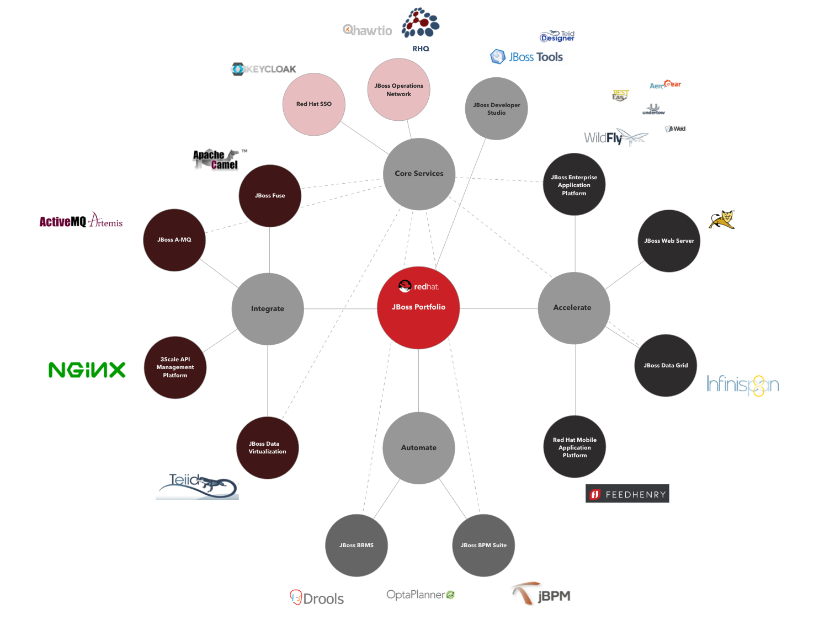

# Awesome JBoss

A list curating resources and information related to JBoss Middleware. The broad range of products, upstream projects and people involved makes it difficult to structurize this information - stay tuned and be patient, later (or later [or later {or later}]) you'll get a nicely structured information pool on JBoss resources here :)

## Official Sites

### Community
* [JBoss Developer](http://www.jboss.org) (http://www.jboss.org)
* [JBoss Developer: JBoss Community >>>Forums<<<](http://www.jboss.org/forums)

### Red Hat
* [Red Hat JBoss Middleware Landing Page](http://www.redhat.com/en/technologies/jboss-middleware)
* [Red Hat Developers: JBoss Enterprise Application Platform](http://developers.redhat.com/products/eap/overview/) 
* [Red Hat Customer Discussions (needs manual filtering first)](https://access.redhat.com/discussions?keyword=&name=&product=All&category=All&tags=All)

## Subprojects
### Community/Upstream

(Mapping the community projects to Red Hat's structure from above...)

**Accelerate**

[WildFly](http://wildfly.org) - Formerly called JBoss Application Server, a name now reserved for the offering supported by Red Hat. Very lightweight Java EE (and JavaScript!) environment, scalable, extensible, normally technically a bit ahead of the JBoss AS

[WildFly Swarm](http://wildfly-swarm.io) - Allows putting services into a single deployable but still Java EE conformant jar. Perfect for microservices.

[Arquillian](http://arquillian.org) - Server side testing done right.

[RestEasy](http://resteasy.jboss.org) - Helps creating REST services on WildFly (being container agnostic, though).

[Weld](http://weld.cdi-spec.org) - Java [CDI](http://cdi-spec.org/) implementation, already integrated in WildFly but check out the [documentation](http://docs.jboss.org/weld/reference/latest/en-US/html/environments.html) if you want to use it elsewhere.

[JBoss Tools](http://tools.jboss.org) - Eclipse plugins for JBoss technology. Red Hat support under the name *JBoss Developer Studio*.

**Integrate**

[JBoss Fuse](http://www.jboss.org/products/fuse/overview/) - The integration component of the broader JBoss middleware stack. Built on Apache Camel, Apache MQ, Apache CXF and Apache Karaf (as well as integrating fabric8, see below), Fuse enables you doing integration projects programatically.

[HornetQ](http://hornetq.jboss.org/) - (Outdated.). Fast and reliable messaging subsystem - got integrated with [Apache MQ Artemis](http://activemq.apache.org/artemis/). 

**Automate**

[KIE Group](http://www.kiegroup.org) - The umbrella project for things related to BPM, BAM, BRM and alike tools. Powerful enterprise stuff.

[Drools (BRMS)](http://www.drools.org) - Business Rules engine *and* framework.

[jBPM](http://www.jbpm.org) - A BPM engine *and* framework.

[Opta Planner](http://www.optaplanner.org) - Constraint satisfaction solver. I.e. a planning engine for the enterprise.

===
(not yet mapped)

[ModeShape](http://modeshape.jboss.org) - Distributed, hierarchical, transactional, and consistent data store. Doesn't get the audience it deserves IMHO.

[Narayana](http://narayana.io) - Transaction manager, even spans across C++ and Java.

[LiveOak](http://liveoak.io) - Looks like a BaaS to me like [BaasBox](http://www.baasbox.com) or [Apache UserGrid](http://usergrid.apache.org). Not sure why/in which way it serves as a JBoss upstream project.

[Nodyn](http://nodyn.io) - Framework allowing running server side JavaScript - bit like a JVM version of Node.js. 

[Keycloak](http://keycloak.jboss.org) - SSO solution (including social auth). Out-of-the box screens, zero-coding setups, session administration etc. Like OpenSSO on steroids. Deployable to an app server, as black box appliance or to OpenShift cartridge/as OpenShift service. Includes the former [PicketLink](http://www.picketlink.org) project. 

[Hawkular](http://www.hawkular.org) - Feature full monitoring and management platform.

[Teiid](http://teiid.jboss.org) - Data virtualization framework. Common layer across DBMS, file systems, services and enterprise legacy systems.

[AeroGear](https://aerogear.org) - Libraries/server-side components helping you build a platform agnostic infrastructure for mobile applications. Currently supported: Android, iOS, JavaScript, Cordova, Windows. Modules: Push, Security, Sync.

[apiman](http://www.apiman.io/) - Allows applying runtime policy governance to APIs. Uses cases e.g.: service throttling, centralized security, billing and metrics.

[fabric8](http://fabric8.io) - Feature complete open source DevOps Platform, supports Docker, Kubernetes, OpenShift. This multi-multi-multi-module stack offers everything from base continuous delivery (incl. Chaos Monkey!) over management (incl. taiga.io! Gerrit! has metrics and is searchable) to communication (Slack!). NB - fabric8 is also a component in the even bigger JBoss Fuse stack.

[Errai](http://erraiframework.org) Based on GWT, Errai allows type safe web applications (HTML5) based on Java EE. Shared code between platform and server.

### Red Hat
[JBoss Enterprise Application Platform (EAP)](http://www.redhat.com/en/technologies/jboss-middleware/application-platform) - Basically the licensed and supported WildFly offering from Red Hat.

[JBoss Fuse](http://www.redhat.com/en/technologies/jboss-middleware/fuse) - Bundles different upstream projects addressing integration (e.g. Apache Camel) to a complete integration suite.

[JBoss A-MQ](http://www.redhat.com/en/technologies/jboss-middleware/amq) - The supported messaging subsystem offering from Red Hat.

[JBoss Data Virtualization](http://www.redhat.com/en/technologies/jboss-middleware/data-virtualization) - Red Hat's complete offering around projects like Teiid.

 

## JBoss (Related) Blogs

* [Geerd Schuring's Blog: Open Source Java Middleware](https://geertschuring.wordpress.com)
* [Markus Eisele's Blog: "Java EE and general Java platforms. You'll read about Conferences, Java User Groups, Java EE, Integration, AS7, WildFly, EAP and other technologies."](http://blog.eisele.net)
* [Dominik Wotruba's Twitter Account - Lots of interesting articles related to JBoss and Java middleware](https://twitter.com/wotruba)
* [Christina Lin's Blog](http://wei-meilin.blogspot.de/) - "Open Source Middleware , Integration Software" Found an excellent intro to Fuse there and many other great articles on Fuse and JBoss middleware.
* [JBoss Asylum - Podcast!](http://asylum.libsyn.com) - A podcast for the JBoss community.
* [In Relation To](http://in.relation.to) - Blog on everything Hibernate.
* [Christian Posta's Blog](http://blog.christianposta.com) - "A blog about all things software, cloud, integration, messaging, and programming" - by a Red Hat Principal Middleware Architect who's also committer to Apache MQ and Apache Camel as well as fabric8 and furthermore a frequent speaker on Red Hat events (and others).  

## Informational Resources (Like DZone)

## People
### [JBoss Heroes](https://www.jboss.org/heroes/)
Red Hat sponsored program - selected members of JBoss Developers that made huge contributions to the products/the community. NB: Only very few are associates of Red Hat, many of them rather propagate Java EE in general, some Glassfish in special.

* [John Ament](https://twitter.com/JohnAment)
* [Paris Apostolopoulos](https://about.me/javapapo)
* [Adam Bien](http://www.adam-bien.com/roller/abien/) - Rather *the* Java EE hero. ([Twitter](https://twitter.com/AdamBien))
* [Antonio Goncalves](http://antoniogoncalves.org)
* [Geert Schuring](https://geertschuring.wordpress.com)  

### Other JBoss Stars That Rock

* [Bob Mc Whirter](https://github.com/bobmcwhirter) - Founder of [procejct:odd](http://projectodd.org), Twitter: [Armadillo Bob](https://twitter.com/bobmcwhirter)
* [Jason T. Greene](https://twitter.com/jtgreene) - WildFly lead.
 

 

## Tutorials

## Books

## Supporting/Related Software

